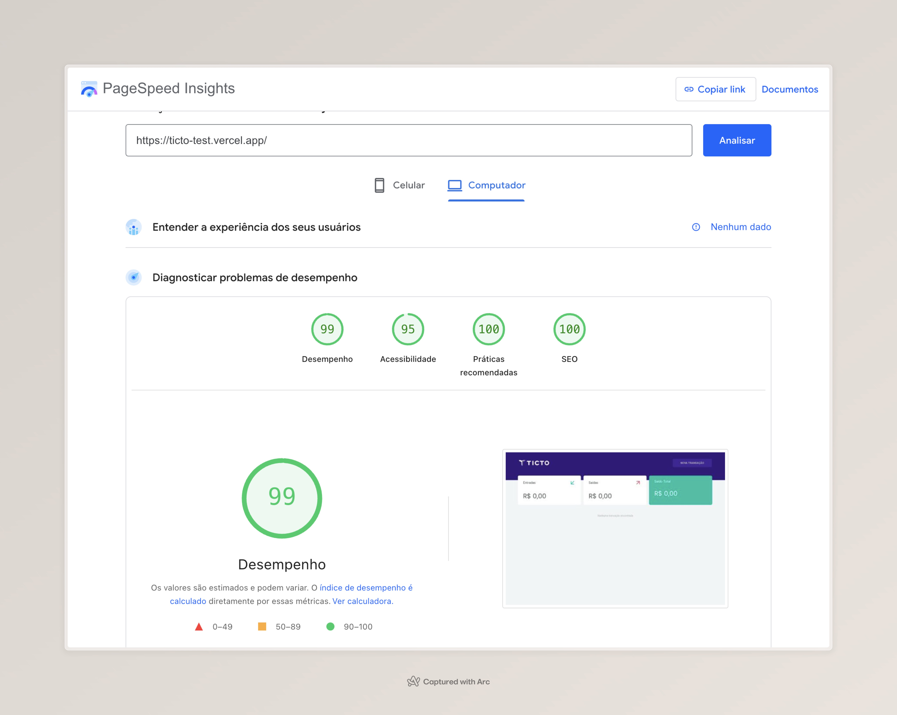

# Ticto Test

A web application for personal finance management, built with modern technologies to ensure the best user experience.

## Technologies

This project was developed using the following technologies:

- [Next.js 15](https://nextjs.org/) - Production-focused React framework
- [TypeScript](https://www.typescriptlang.org/) - JavaScript superset with static typing
- [SASS](https://sass-lang.com/) - CSS preprocessor
- [Keen Slider](https://keen-slider.io/) - Library for creating carousels
- [React Icons](https://react-icons.github.io/react-icons/) - Icon library
- [React Hook Form](https://react-hook-form.com/) - Library for handling forms with high performance and easy validation integration
- [Sentry](https://sentry.io/) - Error monitoring and performance platform
- [Zod](https://zod.dev/) - TypeScript-first schema validation library
- [React Toastify](https://fkhadra.github.io/react-toastify/) - Library for displaying elegant toasts and notifications

## Project

This project is a financial control application where you can:

- Register income and expense transactions
- View total balance
- Track transaction history
- See a financial summary in interactive cards

## Features

- Responsive layout
- Card carousel with indicators
- Automatic balance calculations
- Intuitive and modern interface
- Visual feedback for actions

## Performance

### Core Web Vitals Metrics

- [Access here](https://pagespeed.web.dev/analysis/https-ticto-test-vercel-app/ch7yjw0im2?form_factor=desktop)

- FCP (First Contentful Paint): 0.2s
- LCP (Largest Contentful Paint): 0.8s
- TBT (Total Blocking Time): 160ms
- CLS (Cumulative Layout Shift): 0.004

## Sentry Integration

This project uses [Sentry](https://sentry.io/) for real-time error tracking and observability.

With Sentry, we can monitor:

- Runtime errors and exceptions
- Stack traces with full context
- User impact and session details
- Correlation with performance metrics

## Running the project

To run the project locally, follow the steps below:

1. Clone the repository:
2. Run `yarn` to download dependencies
3. Run `yarn dev` to start the project locally

## Contributing

Contributions are welcome and appreciated!

If you would like to suggest improvements, report bugs, or submit a pull request, please follow these steps:

1. Fork this repository
2. Create a new branch (`git checkout -b feature/your-feature-name`)
3. Commit your changes (`git commit -m 'feat: add new feature'`)
4. Push to your branch (`git push origin feature/your-feature-name`)
5. Open a Pull Request

Feel free to open issues for suggestions or questions as well.
